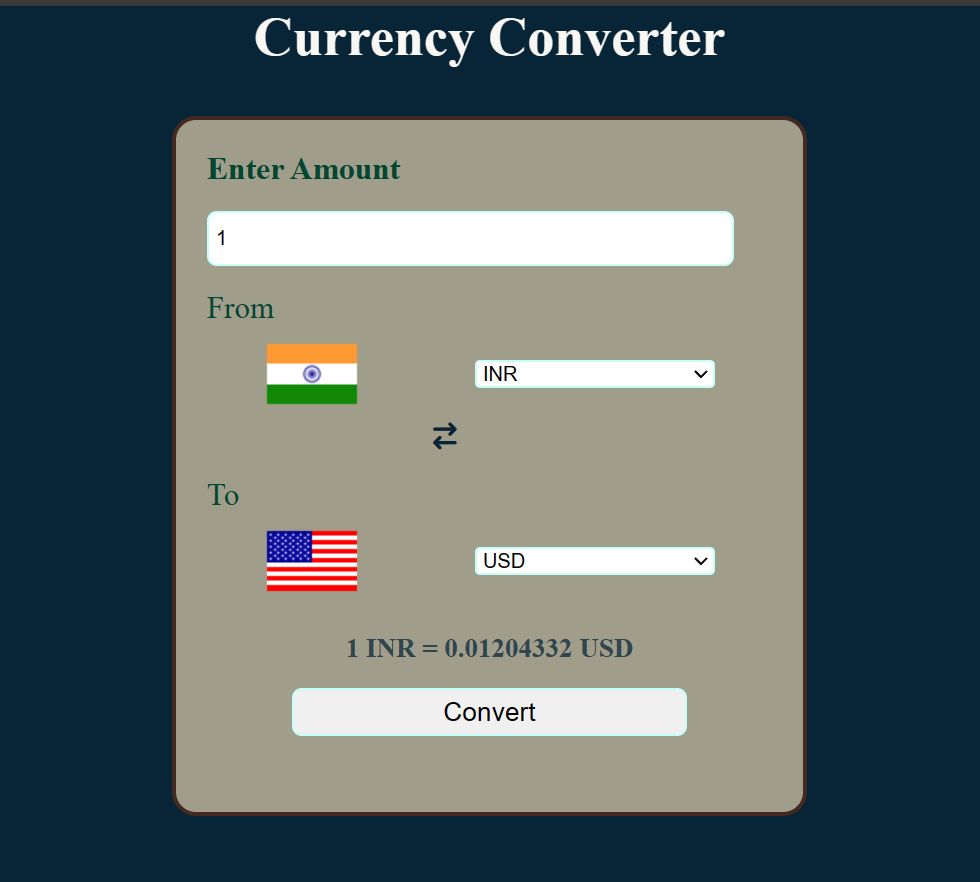
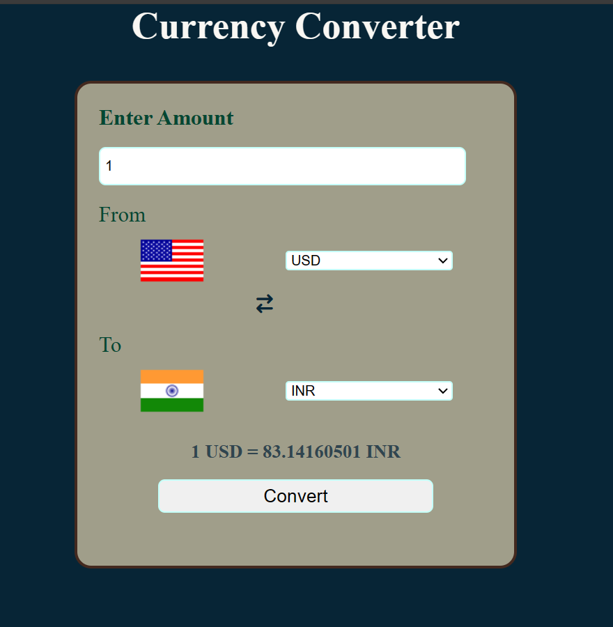
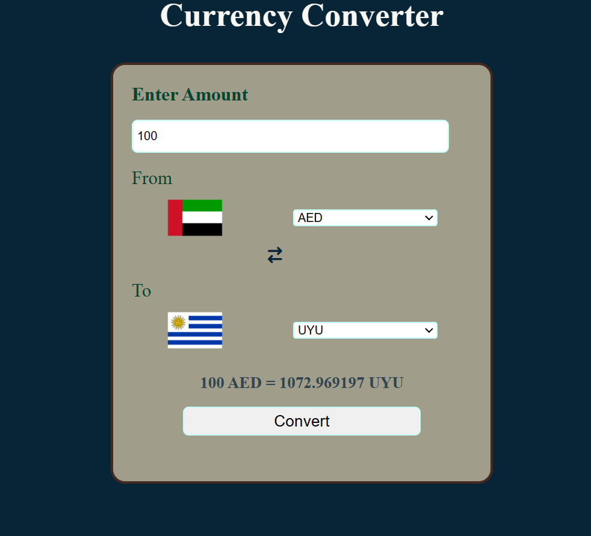

# Currency Converter

This is a simple currency converter web application created using HTML, CSS, and JavaScript. It allows users to convert between different currencies, providing almost real-time exchange rates.

## Features

- **User-Friendly Interface**: A clean and intuitive interface for easy navigation.
- **Real-Time Exchange Rates**: The converter fetches the almost latest exchange rates to ensure accuracy.
- **User-Handy** : Easy to use and understand.
- **Country List** : Added all the country and country code across the world.

## Technologies Used

- HTML
- CSS
- JavaScript

## How to Use

1. Clone the repository:

   ```bash
   git clone https://github.com/yashpandav/Currency_Converter.git

2. Open `index.html` in browser.

2. Add the amount you want to convert.

3. Selcet country currency code of the currency you wanted to convert into the other country currency code.

4. Click on convert button.

5. And that's it. Done.

## File

- `index.html` : Main homepage file
- `currency.css` :  Main stylesheet file
- `currency.js` : Main javascript file for converting currency
- `code.js` : Javascript file for accessing country currency code

## Resources

- [FlagsApi](https://flagsapi.com/) : For fetching country flag
- [jsDelivr](https://www.jsdelivr.com/) : For fetching currency rate
- [FontAwesome](https://fontawesome.com/) : For icon

## Demo





#### I hope that you like it. Please feel free to give me suggestion. 

## To Do
- In this converter i have used currency code in the option but i want to add country name so that user does not have to google for searching currency code of any country.

- To make responsive page.

- 100% accurate answer as per the google.
